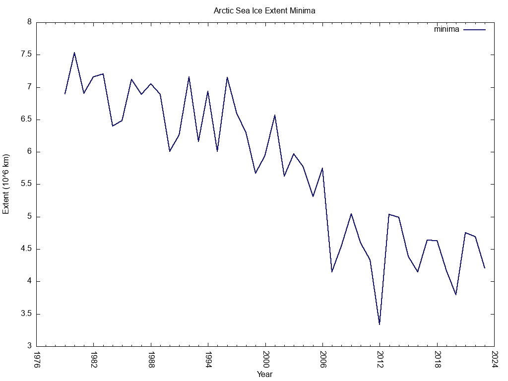
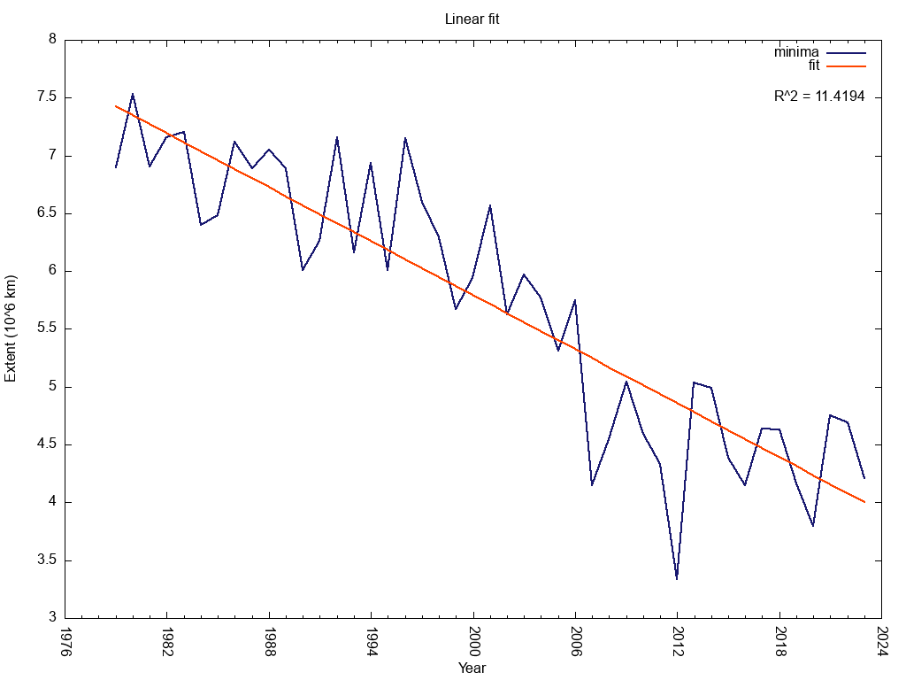
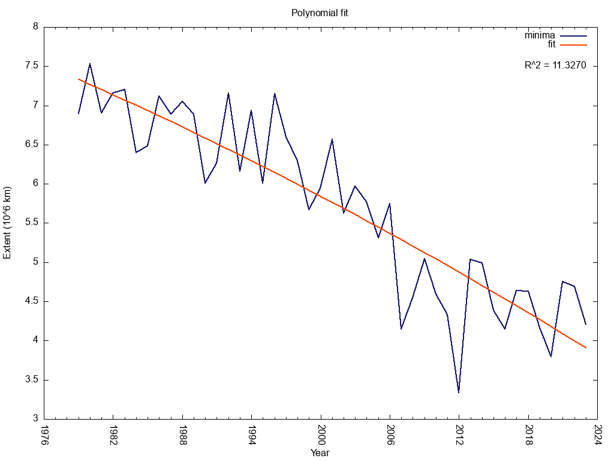
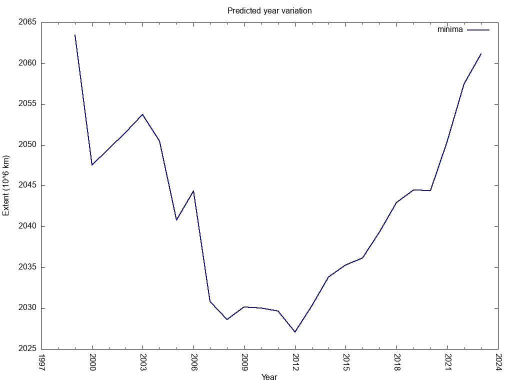

[](https://github.com/paultcochrane/arctic_ice_extent/actions/workflows/testsuite.yml)

# Arctic ice extent

A simple program to download and plot the arctic sea ice extent data
available from the NSIDC (National Snow and Ice Data Center;
http://nsidc.org/).

## Installation

First, clone the repository and change into the project directory:

```shell
$ git clone https://github.com/paultcochrane/arctic_ice_extent.git
$ cd arctic_ice_extent
```

For the plotting to work, you'll need to install
[Gnuplot](http://www.gnuplot.info/).  E.g. on Debian-based systems run this
command:

```shell
$ sudo apt install gnuplot
```

Then, install the project dependencies (assuming that you have `cpanm`
available):

```shell
$ cpanm --installdeps .
```

If you really want to, you can build the `Makefile` and run the tests:

```shell
$ perl Makefile.PL
$ make test
```

## Usage

The most basic usage is to run the program like so:

```shell
$ ./bin/arctic_ice_extent.pl --prune-current-year
```

This will download the latest Arctic sea-ice extent data, plot various
graphs of the data, fit the data to a parabolic function, and extrapolate
the fitted function to determine in which year the sea-ice extent minimum
will be zero.

The determination of the zero sea-ice extent minimum used here is an
unscientific guess at which year this event will occur and is based *only*
on an extrapolation of the currently available data and *does not* contain
any of the associated atmospheric or cryospheric physics.

## Options

### `--use-local-data`

Avoid redundant downloads of upstream data.  After having run the program
once, the current data (which has a daily resolution) doesn't need to be
downloaded again in order to run the program and plot the data.

### `--prune-current-year`

Remove the current year's value from the plots.  Since only the sea-ice
extent minimum is plotted (this usually occurs in September), the minimum
extent for the current year might not yet have been reached and hence the
value for the current year will be incorrect and will distort the curve fit
and any derived information.  By removing ("pruning") the current year's
value from the data, one avoids such distortion.  When running the program
in (say) October, this option should not be necessary.

## Plots

The program generates the following plots

### Arctic sea-ice extent minima versus year (data only)



### Linear fit to the sea-ice extent minima data (with associated R^2 value)



### Polynomial fit to the sea-ice extent minima data (with associated R^2 value)



### Variation in the year of zero sea-ice extent "prediction"


